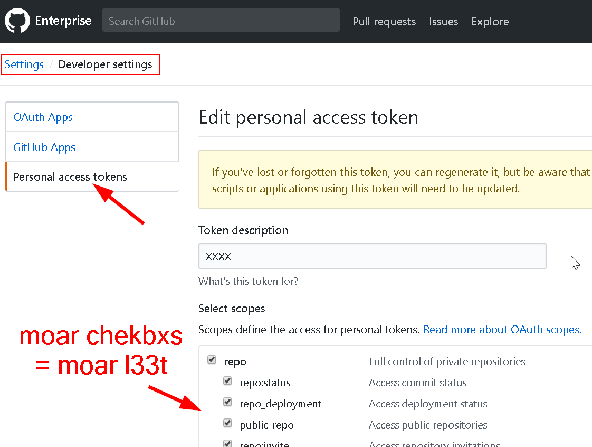

# Profanity parser / autoforker
---

### The scripts herein do two things:

- parseme.ipynb will:
	- scan all the files in said repositories for 'bad words' contained in bad_words.txt
	- generate a dataframe or CSV with the bad words, the file, and the line number they were in

- gitauth.ipynb will:
	- clone an entire organization's repositories to your local drive (use it with parseme to parse an entire git org)
	- fork an entire organization's repositories to another organization 
	- still needs work for setting up teams, etc, and making things into nice classes; goal is to make a library

### Usage

Don't forget to set up your github API token in apikey.json file (example included). 
You can get an API token as follows:

